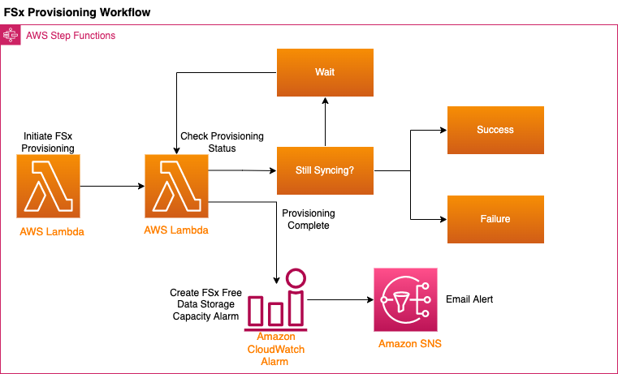

## Provision FSx for Lustre Filesystem using a Step Function


## Architecture


## AWS Services Used
- S3
- SNS
- Lambda
- Step Functions
- FSx for Lustre
- CloudWatch Alarms 

## Justification
This example demonstrates the following concepts:
- Chaining AWS Services using CDK
- Disconnected Event Notifications and Handling
- Creation of resilient storage to attach
- Asynchronous processing of request
- Leveraging Serverless compute to perform a workflow
- Scalable, Serverless Architecture
 
 ## Prerequisites
 To deploy this CDK Application you will need the following
 - [Python 3.9+](https://www.python.org/downloads/)
 - [CDK v2.x](https://docs.aws.amazon.com/cdk/v2/guide/getting_started.html)
 - [AWS CLI v2.x](https://docs.aws.amazon.com/cli/latest/userguide/cli-chap-welcome.html)
 - [Poetry](https://python-poetry.org/)
 - [Docker](https://www.docker.com/products/docker-desktop/) (for building the lambda functions)
 - An AWS profile with valid IAM credentials

## Deploy via CDK
Note: A `Makefile` is included in this project to wrap commands. 
You can review the available commands using `make help`  

The `cdk.json` file tells the CDK Toolkit how to execute your app.

### Local Setup

This project utilizes python and poetry. It assumes that these 2 pre-requisites are installed.
NOTE: In `app.py`, you will need to replace `<SOME VPC ID>` with an AWS VPC ID to be able to deploy. 
NOTE: In `app.py`, you will need to replace `<SOME SUBNET ID>` with an AWS SUBNET ID to be able to deploy. 

To initialize the environment to run this sample:

```
$ make init
```

It is also necessary to have an AWS Account Region that is bootstrapped to run CDK. 

```
$ make bootstrap
```

NOTE: To add additional dependencies, for example other CDK libraries, you will need to run a `poetry` command.

```
$ poetry add <package_name>
```

At this point you can now synthesize the CloudFormation template for this code.

```
$ make synth
```

Now you can deploy the CloudFormation to AWS.

```
$ make deploy
```

You can now begin exploring the source code, contained in the directory.

Finally, to cleanup and remove the stack from the AWS account.

```
make teardown
```

### Testing
There are basic unit tests included that can be run using the following command:

```
$ make test
```
Unit Tests for this project are located in the `tests\unit` folder 

### Other Useful CDK commands
If you wish to run these ny of the following commands for this project 
you will need to prefix them with `poetry run <command>`.
 * `cdk ls`          list all stacks in the app
 * `cdk synth`       emits the synthesized CloudFormation template
 * `cdk deploy`      deploy this stack to your default AWS account/region
 * `cdk diff`        compare deployed stack with current state
 * `cdk docs`        open CDK documentation

## Security

See [CONTRIBUTING](CONTRIBUTING.md#security-issue-notifications) for more information.

## License

This library is licensed under the MIT-0 License. See the LICENSE file.

