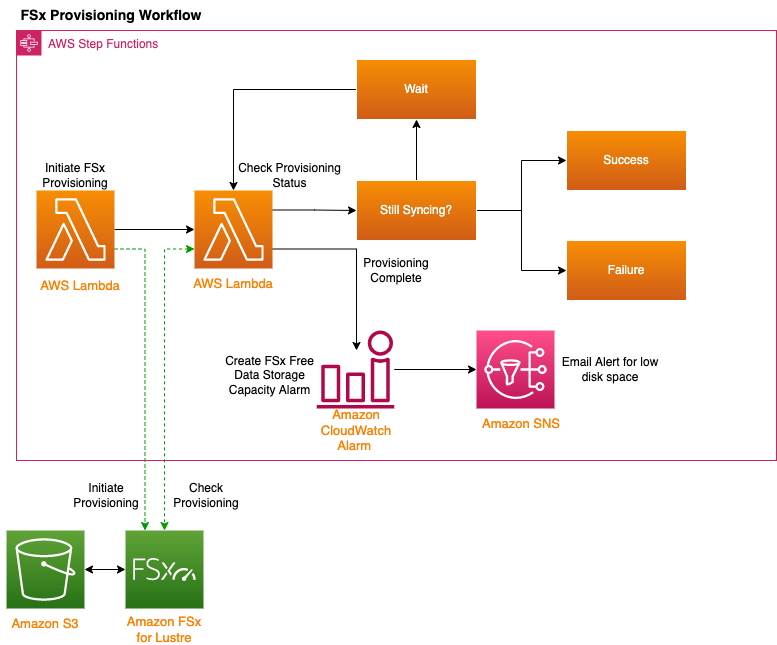

## Provision FSx for Lustre Filesystem using a Step Function

## Architecture

## AWS Services Used
- S3
- SNS
- Lambda
- Step Functions
- FSx for Lustre
- CloudWatch Alarms 

## Justification
This example demonstrates the following concepts:
- Chaining AWS Services using CDK
- Disconnected Event Notifications and Handling
- Creation of resilient storage to attach
- Asynchronous processing of request
- Leveraging Serverless compute to perform a workflow
- Scalable, Serverless Architecture
 
 ## Prerequisites
 To deploy this CDK Application you will need the following
 - Python 3.9+
 - CDK v2
 - Docker (for building the lambda functions)
 - An AWS profile with valid IAM credentials

## Deploy via CDK
See [CDK Instructions](README_CDK.md) for more information.

## Security

See [CONTRIBUTING](CONTRIBUTING.md#security-issue-notifications) for more information.

## License

This library is licensed under the MIT-0 License. See the LICENSE file.

